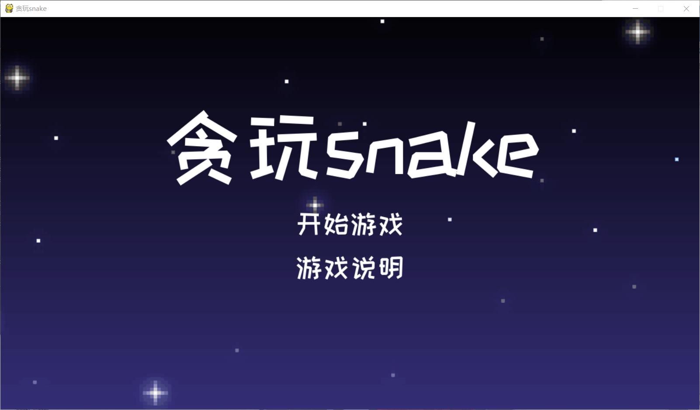
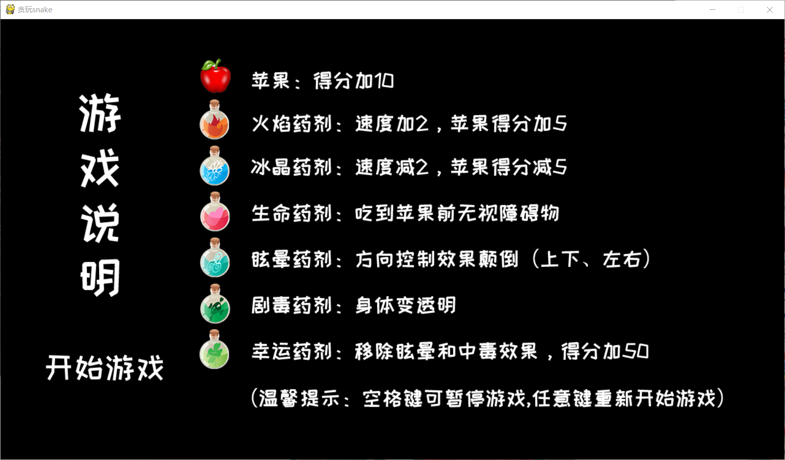
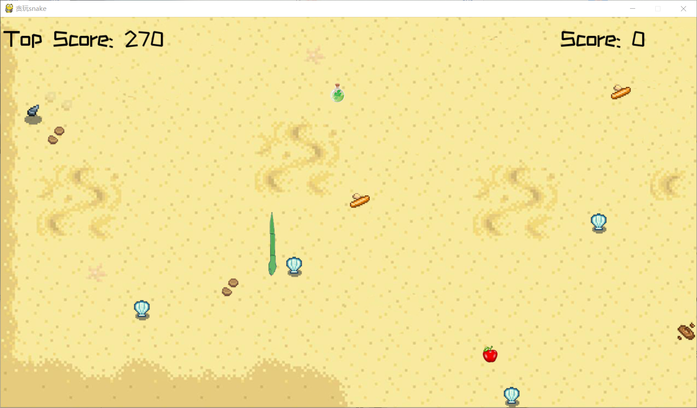
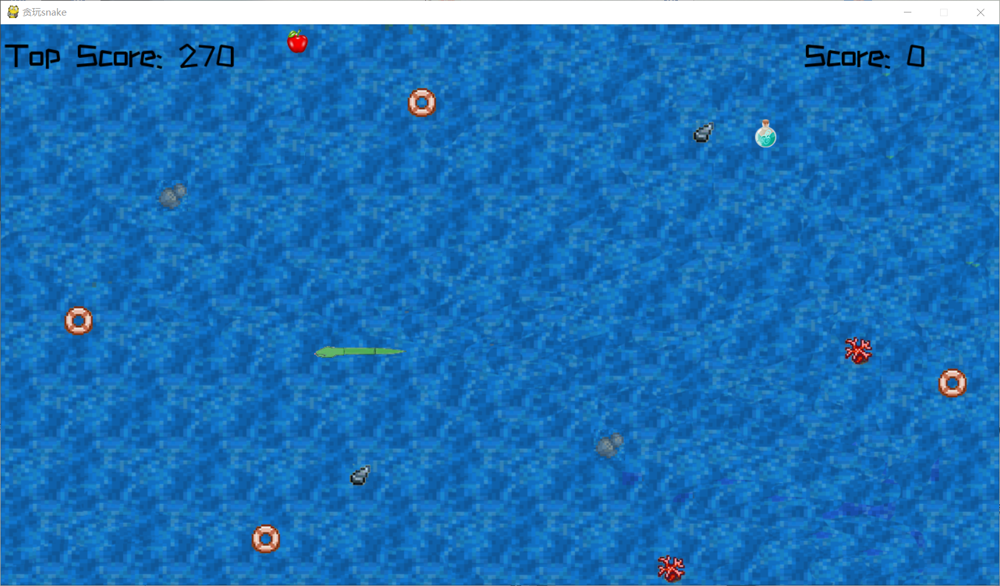
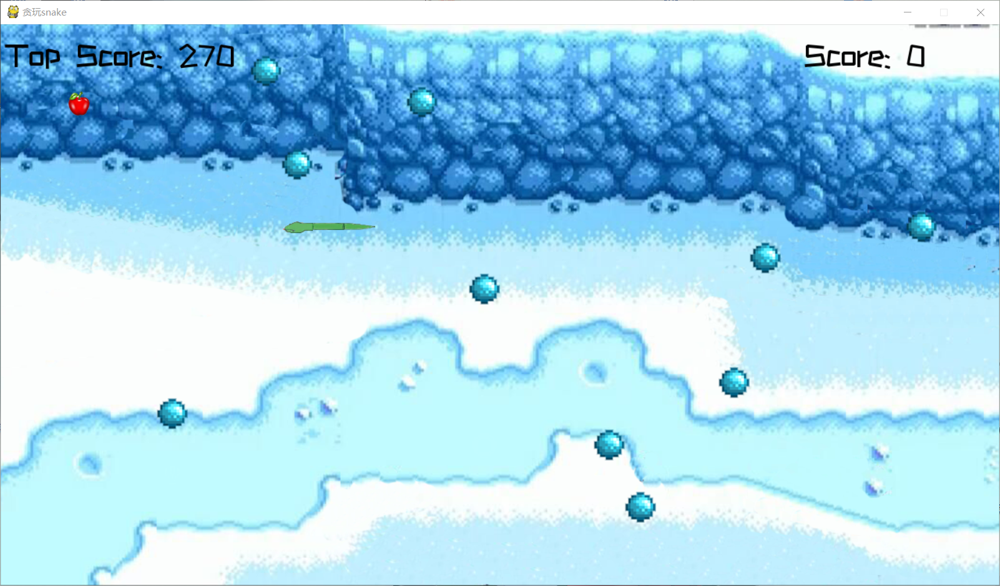
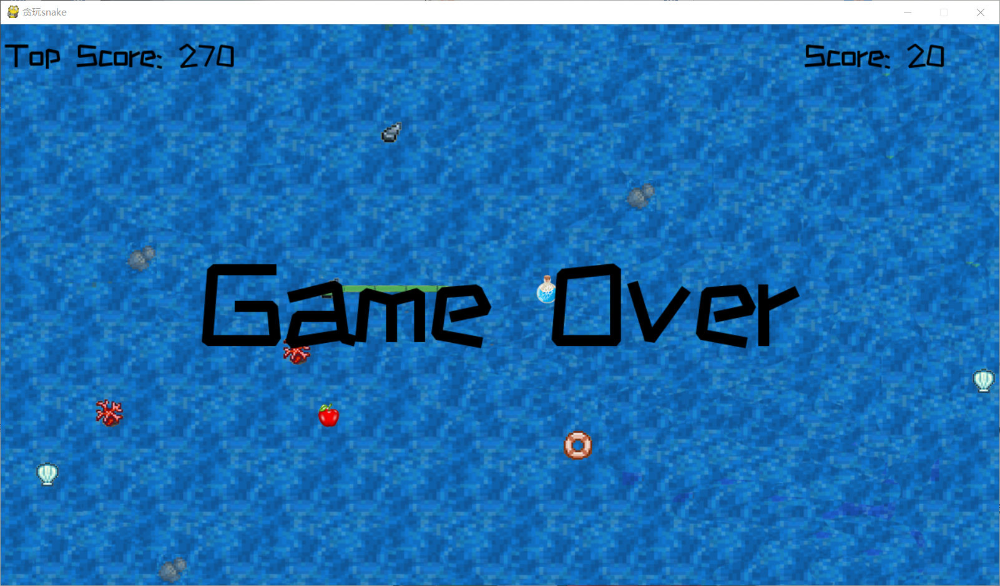

# 贪玩snake

贪吃蛇的运动功能已经基本完善，14种贴图很好地绘制了蛇的运动。

蛇的初始长度为3，初始方向向右，初始速度为10，在地图上随机生成。

苹果随机在地图上生成，当吃掉一个苹果之后随机生成下一个，每个加10分。

六种道具的效果很好地实现。火焰药剂使蛇的速度加2，每个苹果得分加5；冰晶药剂使蛇的速度减2，每个苹果得分减5；生命药剂使蛇在吃到苹果前无视障碍物；眩晕药剂使蛇的方向控制效果颠倒（上下，左右颠倒）；剧毒药剂使蛇的身体变透明（除了蛇头蛇尾和转弯处）：幸运药剂能够移除眩晕和中毒效果，并使得分加50。

每次重新开始游戏时会随机切换不同的地图（一共三种），每种地图上会随机生成十个障碍物（沙漠、海洋5种障碍物，冬日一种障碍物）

整个游戏的地图和障碍物贴图来自《Stardew Valley》,为像素卡通风格。道具贴图和蛇的贴图为购买所得。整体的艺术效果符合预期，配上BGM，十分地可爱。

